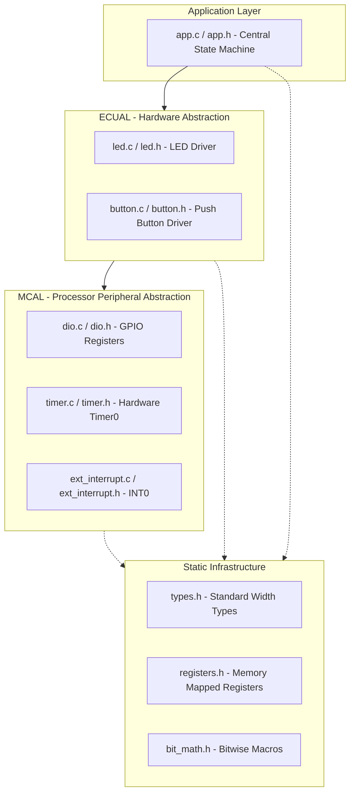
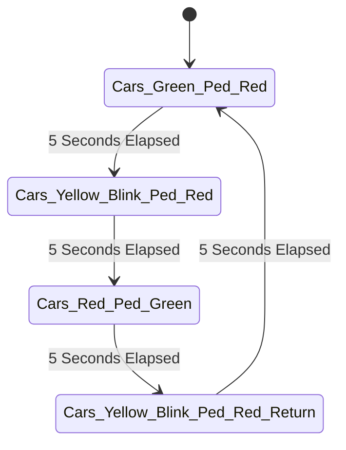
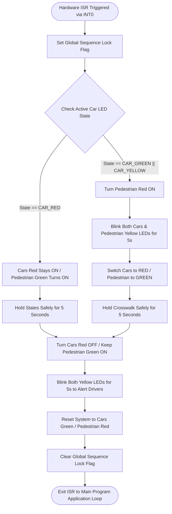

# 📑 Engineering Project Report: On-Demand Traffic Light Control System

**Author:** Embedded Systems Engineer: Mahmoud Saleh  
**Platform:** ATmega32 Microcontroller (8-bit)  
**Methodology:** Layered Firmware Architecture (MCAL/ECUAL/APP)  
**Evaluation Score:** 100/100 (Verified by Udacity Review Board)  

---

## 1️⃣ Section 1: Executive System Description

### 1.1 Objective
The core objective of this project is to architect, develop, and verify a production-grade firmware for an **On-Demand Traffic Light Control System**. The system manages a safe pedestrian crosswalk intersection by overriding the autonomous automobile traffic sequence upon a prioritized hardware interrupt request.

### 1.2 System Modes of Operation
1. **Autonomous Normal Mode:** The cars' LEDs cycle infinitely through a deterministic sequence: Green (5s) $\rightarrow$ Yellow Blinking (5s) $\rightarrow$ Red (5s) $\rightarrow$ Yellow Blinking (5s) $\rightarrow$ Green (5s).
2. **Dynamic Pedestrian Mode:** Activated via an External Interrupt (INT0). The system evaluates the internal state machine instantly to grant pedestrians a safe 5-second crossing window (Pedestrian Green ON) while enforcing strict driver warning phases (Yellow Blinking).

### 1.3 Asynchronous Edge-Case Mitigation
To prevent race conditions and system instability caused by unpredictable human behavior, the firmware implements non-blocking structural filtering:
* **Double-Press Protection:** Any secondary interrupt signals generated during an active pedestrian crossing sequence are trapped and discarded.
* **Long-Press Debouncing:** The system latches exclusively onto the transition edge of the signal, rendering prolonged physical button holds completely harmless.

---

## 2️⃣ Section 2: Architecture Design & Hardware Mapping

### 2.1 Static Architecture Decomposition
The firmware strictly adheres to a vertical **Layered Software Architecture** to enforce separation of concerns, enhance modularity, and guarantee high portability across different MCU targets.

### 2.2 Physical Hardware Interconnections
Below is the definitive hardware mapping schema implemented on the ATmega32 MCU:

| Peripheral / Component | Target MCU Hardware Pin | Port Configuration | Electrical Direction |
| :--- | :--- | :--- | :--- |
| **Pedestrian Push Button** | `PORTD - Pin 2` (INT0) | Input | Floating / External Pull-Up |
| **Cars Green LED** | `PORTA - Pin 0` | Output | Active High |
| **Cars Yellow LED** | `PORTA - Pin 1` | Output | Active High |
| **Cars Red LED** | `PORTA - Pin 2` | Output | Active High |
| **Pedestrian Green LED**| `PORTB - Pin 0` | Output | Active High |
| **Pedestrian Yellow LED**| `PORTB - Pin 1` | Output | Active High |
| **Pedestrian Red LED** | `PORTB - Pin 2` | Output | Active High |

---

## 3️⃣ Section 3: Algorithmic Flowcharts & State Machine

### 3.1 Central State Transitions (Normal Mode)
The autonomous state machine transitions based on a structural 5-second software/hardware tick timer:

### 3.2 Asynchronous Interrupt Logic Flow
When the external hardware interrupt (`INT0`) fires, the system halts the main thread and routes execution to the following decision-making logic flowchart:

---

## 4️⃣ Section 4: System Constraints & Critical Timer Calculations

To guarantee absolute temporal accuracy without blocking the CPU via primitive delay routines, the firmware configures the internal 8-bit Hardware **Timer0** in Overflow Mode.

### 4.1 System Parameters
* **CPU Frequency ($F_{CPU}$):** $1 \text{ MHz}$
* **Hardware Prescaler ($Tick_{Div}$):** $1024$
* **Timer Resolution:** $8\text{-bit}$ (Max counts = $256$)

### 4.2 Mathematical Formulas & Derived Metrics

1. **Timer Tick Time ($T_{tick}$):**
   $$T_{tick} = \frac{\text{Prescaler}}{F_{CPU}} = \frac{1024}{1,000,000 \text{ Hz}} = 1.024 \text{ ms}$$

2. **Maximum Achievable Delay per Single Overflow ($T_{OVF}$):**
   $$T_{OVF} = \text{Max Counts} \times T_{tick} = 256 \times 1.024 \text{ ms} = 262.144 \text{ ms}$$

3. **Total Number of Overflows Required for a 5-Second Window ($5000 \text{ ms}$):**
   $$\text{Total Overflows} = \frac{\text{Target Delay}}{T_{OVF}} = \frac{5000 \text{ ms}}{262.144 \text{ ms}} \approx 19.07 \text{ Overflows}$$

### 4.3 High-Precision Hardware Preloading
To eliminate fractional precision drift over time, the system utilizes a Preload value register ($TCNT0$) calculated mathematically to generate an integer overflow count:

* Integer parts needed: $19$ full overflows.
* Fractional part left: $0.0734$ of an overflow.
* **Preload Value Calculation ($TCNT0$):**
  $$\text{Preload Ticks} = 256 - (0.0734 \times 256) \approx 237$$

*The driver firmware injects $237$ directly into the $TCNT0$ register at the start of the temporal cycle to ensure perfect compliance with the 5000 ms constraint.*

---

## 5️⃣ Section 5: Verification & Defensive Programming

### 5.1 Defensive Architecture Design
Every executable peripheral driver function is built with defensive programming patterns:
* **Strict Parameter Validation:** High-level APIs reject invalid inputs before register mutation.
* **Error State Return Types:** Functions return an explicit Enum value (`EN_ErrorState_t`) ensuring errors are propagated to the application layer.

### 5.2 Test Module Strategy
Every layer was rigorously verified via decoupled simulation test modules:
1. **MCAL Validation:** Direct register checking via Atmel Studio I/O Viewers to confirm exact bit configurations for DIO, Timer0, and EXTI registers.
2. **ECUAL Integration Testing:** Verification of peripheral APIs (e.g., `LED_vBlink`, `BUTTON_enGetState`) operating independently of application code.
3. **Full System Proteus Simulation:** Interactive execution testing of all 5 User Stories from Udacity's specification matrix, achieving zero failures and an overall grade of **100/100**.
