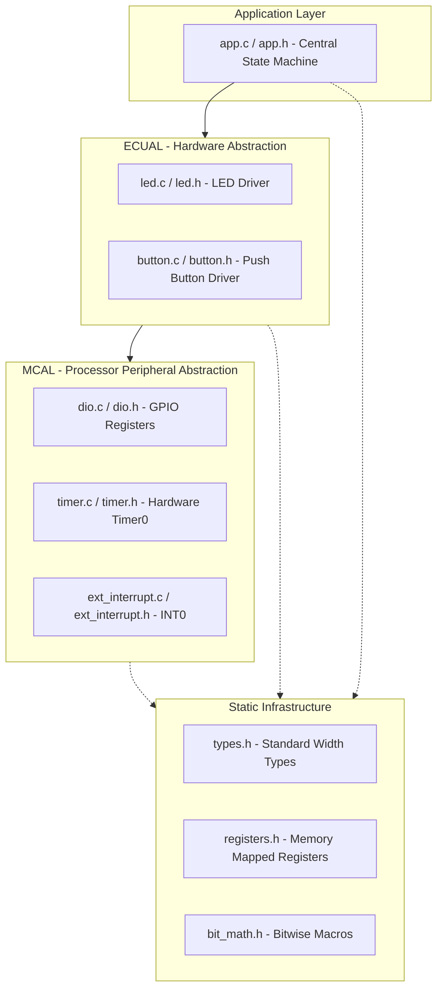
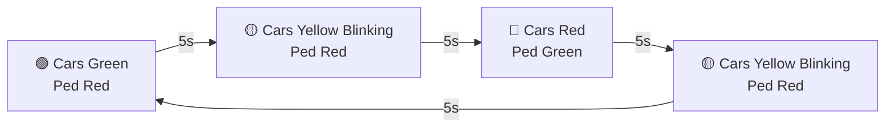
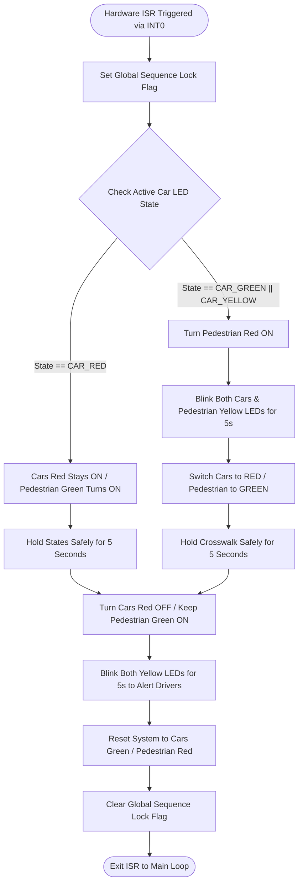

# 🚦 On-Demand Traffic Light Control System

<p align="center">
  <a href="https://linkedin.com">
    
  </a>
  
  
  
</p>

---

## 📌 Project Overview
An advanced, production-grade embedded system firmware developed by **Mahmoud Saleh**. It implements an intelligent, pedestrian-responsive traffic light controller designed using a strict layered architecture pattern. The system dynamically manages state transitions based on hardware interrupt inputs (Push Button via INT0) while enforcing safety protocols to protect both drivers and pedestrians.

---

## 📁 Repository Directory Structure
The workspace is cleanly structured to isolate hardware dependencies and follow the standard Embedded Systems architectural design:

```text
📁 On-demand-Traffic-light-control
├── 📁 Application          <-- High-level system control & State-Machine (app.c/app.h)
├── 📁 ECUAL                <-- External Components Interface (LED, Button drivers)
├── 📁 MCAL                 <-- Microcontroller Abstraction Layer (DIO, Timer0, EXTI)
├── 📁 Utilities            <-- Common Macros, Register maps & Standard Data Types
├── 📁 proteus              <-- Contains the official Proteus schematic files
└── 📁 Documentation        <-- Supplementary files (Project Report PDF & Diagrams)
    ├── 📁 images
    │   ├── schematic_preview.png
    │   └── flowchart.png
    └── project_report.pdf
├── .gitignore              <-- Auto-configured rules for Microchip Studio & Proteus files
├── LICENSE                 <-- Official MIT License file
├── project_two.cproj       <-- Microchip Studio configuration project file
└── README.md               <-- Main repository documentation
```

---

## 🏗️ Static Architecture Design
The firmware relies on a vertical **Layered Architecture** to enforce modularity and ensure compliance with SOLID principles.



---

## 🔌 Hardware Configurations & Pin Mapping

| Peripheral Component | MCU Pin Connection | Port Configuration | Electrical Direction |
| :--- | :--- | :--- | :--- |
| **Pedestrian Push Button** | `PORTD - Pin 2` (INT0) | Input | Floating / External Pull-Up |
| **Cars Green LED** | `PORTA - Pin 0` | Output | Active High |
| **Cars Yellow LED** | `PORTA - Pin 1` | Output | Active High |
| **Cars Red LED** | `PORTA - Pin 2` | Output | Active High |
| **Pedestrian Green LED**| `PORTB - Pin 0` | Output | Active High |
| **Pedestrian Yellow LED**| `PORTB - Pin 1` | Output | Active High |
| **Pedestrian Red LED** | `PORTB - Pin 2` | Output | Active High |

---

## ⚙️ System Flowcharts & Algorithms

### 1. Normal Mode Cycle
Continuous autonomous loop executed in the main background thread.



### 2. Pedestrian On-Demand Handling (Asynchronous ISR Logic)
Triggered immediately on the hardware external interrupt vector (INT0).



---

## 🛠️ Unified API Documentation & Drivers Reference

Every driver is implemented utilizing defensive programming concepts and returns an explicit error state enum (`EN_ErrorState_t`).

### 1. MCAL Layer APIs

#### 🔹 DIO Driver (`dio.h`)
* `EN_ErrorState_t DIO_enInitPin(uint8_t u8PortId, uint8_t u8PinId, uint8_t u8Direction);`
  * *Description:* Initializes a specific pin direction (INPUT/OUTPUT).
* `EN_ErrorState_t DIO_enWritePin(uint8_t u8PortId, uint8_t u8PinId, uint8_t u8Value);`
  * *Description:* Sets a pin state high (1) or low (0).
* `EN_ErrorState_t DIO_enReadPin(uint8_t u8PortId, uint8_t u8PinId, uint8_t* pu8Value);`
  * *Description:* Reads the logic level of a targeted input pin.
* `EN_ErrorState_t DIO_enTogglePin(uint8_t u8PortId, uint8_t u8PinId);`
  * *Description:* Inverts the current logical state of a pin.

#### 🔹 Timer Driver (`timer.h`)
* `EN_ErrorState_t TIMER_enInit(void);`
  * *Description:* Configures Timer0 peripheral parameters to act in Normal/Overflow mode.
* `EN_ErrorState_t TIMER_enStart(uint16_t u16Prescaler);`
  * *Description:* Sets the clock prescaler divider to activate the timer tick.
* `EN_ErrorState_t TIMER_enStop(void);`
  * *Description:* Halts the hardware counter.
* `EN_ErrorState_t TIMER_enSetDelay_ms(uint32_t u32Delay_ms);`
  * *Description:* Uses a calculated overflow loop blocking algorithm to deliver precise millisecond delays.

#### 🔹 External Interrupt Driver (`ext_interrupt.h`)
* `EN_ErrorState_t EXTI_enInitINT0(uint8_t u8TriggerEdge);`
  * *Description:* Enables INT0 vector line and maps the triggering edge (Rising/Falling/Any Change).
* `EN_ErrorState_t EXTI_enSetCallBackINT0(void (*pfCallBackAction)(void));`
  * *Description:* Stores the application-level function address to safely invoke inside the vector ISR.

---

### 2. ECUAL Layer APIs

#### 🔹 LED Driver (`led.h`)
* `EN_ErrorState_t LED_enInit(uint8_t u8LedPort, uint8_t u8LedPin);`
  * *Description:* Maps the targeted LED hardware port pin and triggers DIO configuration as an Output.
* `EN_ErrorState_t LED_enTurnOn(uint8_t u8LedPort, uint8_t u8LedPin);`
  * *Description:* Injects a logical High signal to light up the LED.
* `EN_ErrorState_t LED_enTurnOff(uint8_t u8LedPort, uint8_t u8LedPin);`
  * *Description:* Cuts off the voltage signal to dim the LED.
* `EN_ErrorState_t LED_enBlink_5s(uint8_t u8LedPort1, uint8_t u8LedPin1, uint8_t u8LedPort2, uint8_t u8LedPin2);`
  * *Description:* Toggles synchronous components back and forth at a stable internal frequency to yield a 5-second blinking warning.

#### 🔹 Push Button Driver (`button.h`)
* `EN_ErrorState_t BUTTON_enInit(uint8_t u8BtnPort, uint8_t u8BtnPin);`
  * *Description:* Provisions the hardware pin line to act as an input line for capturing human responses.
* `EN_ErrorState_t BUTTON_enGetState(uint8_t u8BtnPort, uint8_t u8BtnPin, uint8_t* pu8State);`
  * *Description:* Acquires the continuous digital level input value while dealing with logical debouncing.

---

## 📐 System Constraints & Critical Timer Calculations
To achieve absolute timing execution without blocking core operations via uncalibrated delay headers, the system leverages an internal **Timer0 (8-bit resolution)** running with a clock divider prescaler of **1024** at a CPU Frequency of **1 MHz**.

### Derived Timing Variables:
1. **Single Tick Duration ($T_{tick}$):**
   $$T_{tick} = \frac{\text{Prescaler}}{F_{CPU}} = \frac{1024}{1,000,000 \text{ Hz}} = 1.024 \text{ ms}$$
2. **Maximum Overflow Metric ($T_{OVF}$):**
   $$T_{OVF} = 256 \text{ max counts} \times 1.024 \text{ ms} = 262.144 \text{ ms}$$
3. **Total Overflows for 5-Second Threshold ($5000 \text{ ms}$):**
   $$\text{Total Overflows} = \frac{5000 \text{ ms}}{262.144 \text{ ms}} \approx 19.07 \text{ Overflows}$$
4. **Calculated Initial Preload Register Value ($TCNT0$):**
   $$\text{Preload Ticks} = 256 - (0.0734 \times 256) \approx 237$$

*The driver software loads $237$ directly into the $TCNT0$ register at the initialization boundary of the temporal cycle to ensure perfect compliance with the 5000 ms constraint.*

---
---

## 🧪 Edge Case Verification & User Stories
* **Story 1 (Normal Cross):** Clicked during Cars' Green light triggers Yellow blinking for 5s, halts cars, and lets pedestrians cross.
* **Story 2 (Pre-emptive Cross):** Clicked during Cars' Yellow light forces all Yellow lights to blink synchronously for 5s before prioritizing lanes.
* **Story 3 & 4 (Safe Refusal):** Immediate short press during Cars' Red light or accidental prolonged Long Press is safely avoided by software gates.
* **Story 5 (Double-Press Mitigation):** Secondary fast click triggers execute the first sequence correctly while locking any incoming interrupt calls to shield runtime context.

---

## 🚀 Execution & Verification
* **Launch Tools:** Open **Microchip Studio (Atmel Studio)**.
* **Compile Firmware:** Build the project toolchain to construct the `.hex` application binary file.
* **Load Circuit:** Access the simulation environment file inside the `/proteus` directory using Labcenter Proteus.
* **Run Simulation:** Execute the interactive engine to visualize live waveforms and test hardware states.

---

## 👨‍💻 Author
**Mahmoud Saleh**
* Embedded Software Engineer
* [GitHub Profile](https://github.com/Mahmoud976)
* [LinkedIn Profile](https://www.linkedin.com/in/mahmoud-m-saleh/)
---

## 📜 License
* Distributed under the **MIT License**.
* See the `LICENSE` file for more information.
* This project is completely free to use for educational and commercial purposes.


