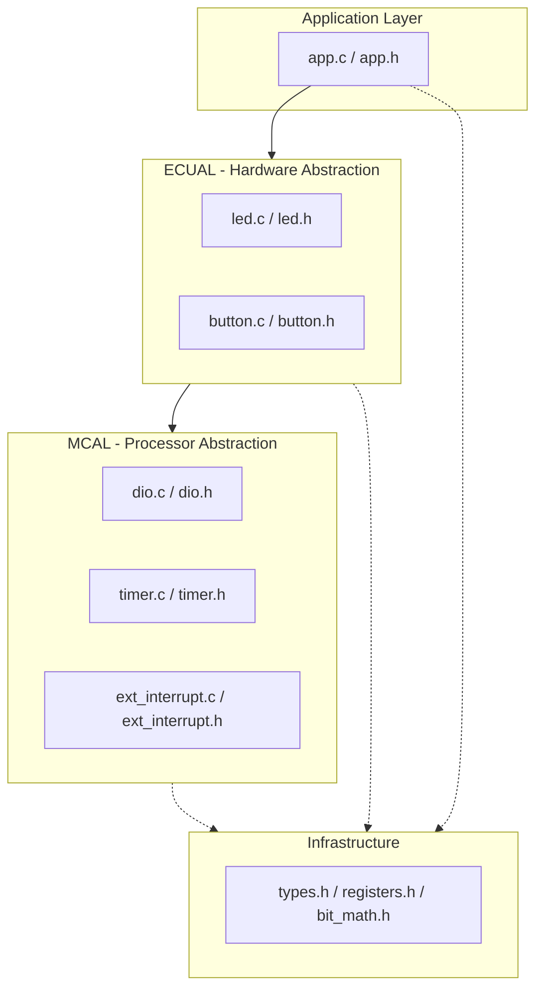
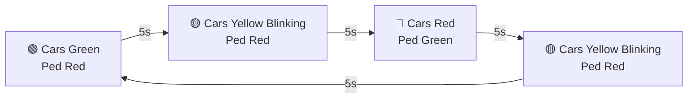
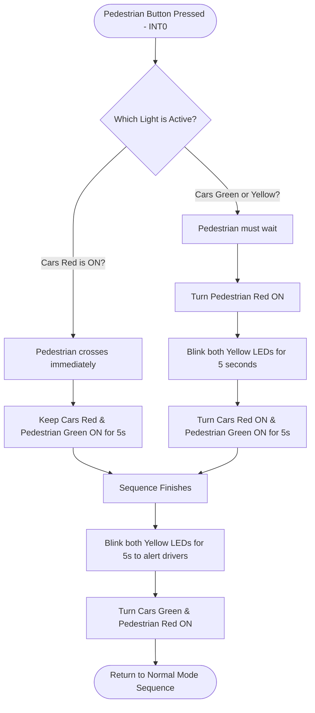

# 🚦 On-Demand Traffic Light Control System

  
  
  
  

---

## 📌 Project Overview
An advanced embedded system firmware that controls an intelligent, pedestrian-responsive traffic light system. It manages state transitions dynamically based on user interaction (Push Button via External Interrupts) while adhering to strict safety protocols for both drivers and pedestrians.

---

## 🏗️ Architectural Structure (Static Design)
The software follows a robust **Layered Architecture** pattern to guarantee hardware independence, modularity, and compliance with SOLID principles.

---

## ⚙️ Algorithms & System Flowcharts

### 1. Normal Mode Cycle
In default state, the system continuously transitions the cars' traffic lights sequentially every **5 seconds**.

### 2. Pedestrian On-Demand Handling (Interrupt Service Routine)
When the pedestrian presses the crosswalk button (**INT0**), the system executes the following algorithm depending on the current state:

---

## 🔌 Hardware Configurations & Mapping
* **MCU Platform:** ATmega32 8-bit Microcontroller
* **External Interrupt Pin:** `PORTD Pin 2 (INT0)` -> Connected to Pedestrian Button.
* **Cars' LEDs:** `PORTA` -> Pin 0 (Green), Pin 1 (Yellow), Pin 2 (Red).
* **Pedestrians' LEDs:** `PORTB` -> Pin 0 (Green), Pin 1 (Yellow), Pin 2 (Red).

---

## 🧪 Mitigation & Safety Features (User Stories)
* **Double Press:** Instantly ignores any secondary button trigger while a cross sequence is ongoing to prevent state corruption.
* **Long Press:** The system triggers exclusively on the falling/rising edge of a pulse, safely treating long presses as a single action.

---

## 🚀 Getting Started & Execution
1. Open the project toolchain inside **Microchip Studio**.
2. Build the project to get the `.hex` file.
3. Open the schematic located inside the `/proteus` folder using Labcenter Proteus.
4. Run the interactive simulation.

---

## 📜 License
Distributed under the **MIT License**. See `LICENSE` for more information. This project is completely free to use for educational and commercial purposes.
